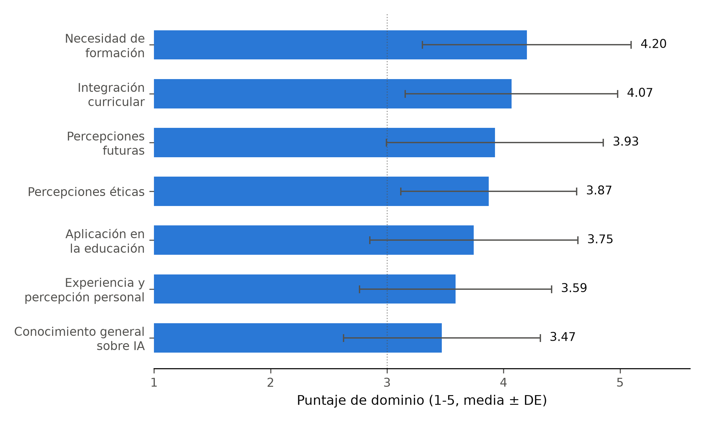
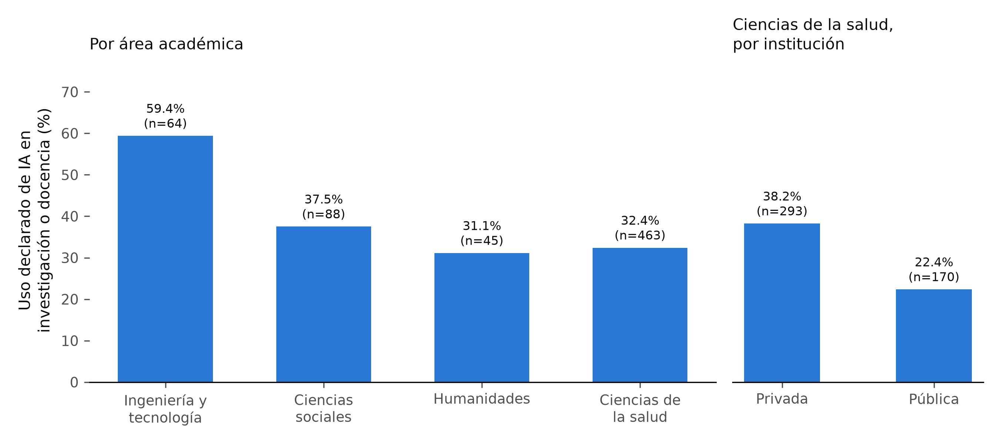

**Andrea Paola Britos Gómez¹ (ORCID: 0009-0000-8655-9881, paola.britos@chauxlab.com), Alcides Chaux¹\* (ORCID: 0000-0002-5824-9867, alcides.chaux@chauxlab.com)**

¹ChauxLab Institute, Asunción, Paraguay

\*Autor de correspondencia: Alcides Chaux — alcides.chaux@chauxlab.com

# RESUMEN

**Antecedentes:** Los docentes universitarios darán forma al uso y la enseñanza de la inteligencia artificial en la educación superior. Su conocimiento, sus preocupaciones éticas y su uso real de estas herramientas no se han descrito en Paraguay.

**Objetivo:** Describir el conocimiento autopercibido, las preocupaciones éticas, las necesidades de formación y el uso declarado de inteligencia artificial entre docentes universitarios de Paraguay.

**Métodos:** Docentes de universidades públicas y privadas completaron un cuestionario Likert de 25 ítems en línea entre diciembre de 2023 y enero de 2024, por conveniencia. Los puntajes de dominio fueron promedios no ponderados; la consistencia interna se estimó en la muestra analítica, y las asociaciones con la edad y los años de docencia, con coeficientes de Spearman.

**Resultados:** Los 667 cuestionarios estaban completos. La mayoría enseñaba en ciencias de la salud (69,4 %), era de sexo femenino (74,5 %) y trabajaba en instituciones privadas (70,9 %); la edad media fue de 46,0 años (DE 10,3). El acuerdo con comprender los principios básicos de la IA fue del 67,2 %, frente al 48,6 % para explicar su influencia en la disciplina propia; el conocimiento no se relacionó con los años de docencia (ρ = −0,006). El acuerdo con que deben considerarse las implicancias éticas fue del 83,8 %, y el 91,6 % deseaba comprender mejor esos aspectos. El uso declarado en investigación o docencia fue del 35,2 % (235/667): 59,4 % en ingeniería y tecnología frente a 32,4 % en ciencias de la salud.

**Conclusiones:** La preocupación ética y la demanda de formación fueron generalizadas; el uso declarado siguió siendo minoritario y varió según la disciplina. La encuesta registra percepciones autoinformadas, no conocimiento evaluado, y no sostiene afirmaciones causales.

**Palabras clave:** inteligencia artificial; bioética; educación superior; docentes universitarios; desarrollo docente; Paraguay

# ABSTRACT

**Background:** University teachers will shape how artificial intelligence is used and taught in higher education. Their knowledge, ethical concerns, and actual use of these tools have not been described in Paraguay.

**Objective:** To describe self-rated knowledge of artificial intelligence, ethical concerns, training needs, and reported use among university teachers in Paraguay.

**Methods:** Teachers at public and private universities completed an online 25-item Likert questionnaire between December 2023 and January 2024. Recruitment was by convenience. Domain scores were unweighted item means. Internal consistency was estimated in the analytic sample. Associations with age and years of teaching used Spearman coefficients.

**Results:** All 667 questionnaires were complete. Most respondents taught in the health sciences (69.4%), were female (74.5%), and worked in private institutions (70.9%). Mean age was 46.0 years (SD 10.3). Agreement on understanding the basic principles of artificial intelligence was 67.2%, against 48.6% for being able to explain its influence on one's own discipline. Knowledge scores were unrelated to years of teaching (Spearman ρ = −0.006). Agreement that ethical implications must be considered was 83.8%, and 91.6% wanted a better understanding of those aspects. Reported use in research or teaching was 35.2% (235/667), and was 59.4% in engineering and technology against 32.4% in the health sciences.

**Conclusions:** Ethical concern and demand for training were widespread, while reported use remained a minority practice and differed by discipline. The survey records self-rated perceptions, not tested knowledge, and supports no causal claim.

**Keywords:** artificial intelligence; bioethics; higher education; university teachers; faculty development; Paraguay

# INTRODUCCIÓN

La inteligencia artificial está entrando en la educación superior con la suficiente rapidez como para que se pida al profesorado decidir cómo enseñar con ella y sobre ella antes de que exista un cuerpo de práctica acordado. Los docentes ocupan una posición decisiva en ese proceso: un estudio transversal en una institución de Estados Unidos encontró que el profesorado usaba inteligencia artificial generativa con más frecuencia que el estudiantado y calificaba más alto su importancia futura, aunque la formación formal seguía siendo poco frecuente en ambos grupos [1]. Las perspectivas del profesorado no son un simple sustituto de las del estudiantado: docentes de odontología en India y docentes y estudiantes de enfermería en Estados Unidos informan apoyo a la integración junto con preocupaciones sobre formación, ética y carga de trabajo propias del rol de enseñar [2,3]. Los análisis de qué predice esa adopción convergen en la autoeficacia y las expectativas de resultado, más que en el mandato institucional [4].

La preocupación ética es un hallazgo recurrente. Una guía estructurada para docentes de medicina identifica la transparencia, el sesgo, la protección de datos y la rendición de cuentas como asuntos que el profesorado necesita estar preparado para manejar, no solo conocer [5], y una evaluación de necesidades entre estudiantes de medicina pide una reestructuración curricular en torno a las mismas preocupaciones [6]. La preocupación ética sobre la inteligencia artificial en enfermería es casi universal incluso donde el conocimiento es limitado [7], y docentes de anatomía que sopesan promesas y riesgos llegan a una conclusión comparable [8]. Las encuestas de conocimiento-actitud-práctica en estudiantes de medicina y otros profesionales de la salud describen un patrón consistente: actitudes favorables, conocimiento limitado, y demanda alta de formación estructurada, incluida la ética [9-14]; una revisión de enfermería agrega que la ansiedad y la autoeficacia moderan esa disposición [15], y un estudio con instrumento validado de aceptación de tecnología informa la misma tensión entre actitud favorable y uso modesto [16].

La mayor parte de esta evidencia describe a estudiantes o a profesionales de la salud distintos del profesorado que los forma, y proviene de profesiones aisladas [2,3,9-14]. Los docentes universitarios como grupo, que abarca distintas áreas académicas y no una sola profesión de la salud, y específicamente en América Latina, están menos representados. Una revisión de la educación superior de la región durante la pandemia describió brechas de formación docente y preparación institucional para herramientas digitales, en un contexto no específico de inteligencia artificial [17], pero no se identificó una descripción comparable para docentes en Paraguay.

# OBJETIVO

Describir el conocimiento autopercibido, las preocupaciones éticas, las necesidades de formación, el apoyo curricular y el uso declarado de inteligencia artificial entre docentes universitarios de Paraguay, y examinar su variación según experiencia docente, edad y área académica.

# MÉTODO

Se trató de una encuesta cuantitativa, exploratoria y transversal a docentes universitarios en ejercicio activo en instituciones de educación superior públicas y privadas de Paraguay. El reclutamiento fue por conveniencia, a través de canales institucionales, entre diciembre de 2023 y enero de 2024. Este informe sigue las recomendaciones STROBE para estudios transversales [18]. Debido a que el reclutamiento utilizó canales institucionales y no un listado de docentes invitados individualmente, no se dispuso de un marco muestral ni de un denominador fijo de docentes elegibles, y no pudo calcularse una tasa de respuesta.

El cuestionario se construyó para este estudio. Preguntaba por área académica, años de docencia, edad, sexo y tipo de institución, seguido de 25 enunciados en siete dominios: conocimiento general sobre inteligencia artificial, percepciones éticas, aplicación en la educación, necesidades de formación, integración curricular, experiencia personal y percepciones futuras, y cerraba con un único ítem abierto que invitaba a cualquier comentario adicional. Cada enunciado Likert usó una escala de cinco puntos de "totalmente en desacuerdo" a "totalmente de acuerdo". Cinco revisores con experiencia en inteligencia artificial, bioética o educación superior comentaron sobre claridad y pertinencia, y el instrumento se piloteó con 25 docentes universitarios antes del trabajo de campo; esas respuestas del panel y del piloto se usaron solo para depurar la redacción de los ítems y no forman parte de la muestra analítica. El cuestionario se administró luego en Microsoft Forms. La página de apertura describía el estudio y el tiempo esperado de 5 a 10 minutos. La participación fue voluntaria.

Las respuestas se codificaron de 1 (totalmente en desacuerdo) a 5 (totalmente de acuerdo) en el sentido en que estaban escritas. Ningún ítem se codificó de manera invertida. Un puntaje de dominio fue el promedio no ponderado de sus ítems. El acuerdo con un ítem fue la suma de "de acuerdo" y "totalmente de acuerdo". La consistencia interna de cada dominio se estimó con el alfa de Cronbach en la muestra analítica; esta estimación describe las 667 respuestas analizadas y no constituye una validación psicométrica independiente del instrumento, y no se realizó un análisis factorial. La edad y los años de docencia se resumieron con la media, la desviación estándar, la mediana y el rango. Su asociación entre sí y con el puntaje de conocimiento se estimó con coeficientes de Spearman. El contraste de grupos preespecificado comparó los puntajes de conocimiento de los docentes de ingeniería y tecnología con los de todas las demás áreas, mediante una prueba de Mann-Whitney a dos colas y la d de Cohen, con un nivel de significación de 0,05. El uso declarado de inteligencia artificial se describió como proporción, en general, por área académica y, entre los docentes de ciencias de la salud, por tipo de institución. Las respuestas abiertas se leyeron en su totalidad para verificar contenido identificatorio; no se analizan de otro modo en este informe. Los análisis se ejecutaron en Python 3. Un cuestionario con alguna respuesta Likert faltante habría quedado excluido de los puntajes de dominio.

## Consideraciones éticas

Antes del reclutamiento, el protocolo se sometió a consideración del comité de la Universidad Europea del Atlántico. El comité aprobó el estudio porque el cuestionario era anónimo y no requería recolectar, usar ni almacenar datos personales. No se asignó un número de aprobación. El formulario exigía una respuesta activa de consentimiento antes de mostrar cualquier ítem. No solicitaba el nombre del respondiente, sus datos de contacto ni el nombre de la institución empleadora.

# RESULTADOS

El archivo analítico contenía 667 cuestionarios completos, cada uno con un identificador distinto. Ciencias de la salud representó 463 respondientes (69,4 %), ciencias sociales 88 (13,2 %), ingeniería y tecnología 64 (9,6 %), humanidades 45 (6,7 %) y ciencias agrícolas 7 (1,0 %). Por sexo, 497 respondientes (74,5 %) fueron de sexo femenino y 170 (25,5 %) de sexo masculino. Las instituciones privadas aportaron 473 respondientes (70,9 %) y las públicas 194 (29,1 %). La edad varió de 27 a 76 años (media 46,0, DE 10,3; mediana 47). Los años de docencia variaron de 1 a 41 (media 15,3, DE 9,6; mediana 14). La edad y la experiencia docente se asociaron positivamente (ρ de Spearman = 0,75).

**Tabla 1. Características de los 667 respondientes**

| Característica | Valor |
| --- | --- |
| Área académica, n (%) | |
| Ciencias de la salud | 463 (69,4) |
| Ciencias sociales | 88 (13,2) |
| Ingeniería y tecnología | 64 (9,6) |
| Humanidades | 45 (6,7) |
| Ciencias agrícolas | 7 (1,0) |
| Sexo, n (%) | |
| Femenino | 497 (74,5) |
| Masculino | 170 (25,5) |
| Institución, n (%) | |
| Privada | 473 (70,9) |
| Pública | 194 (29,1) |
| Edad, años, media (DE) | 46,0 (10,3) |
| Experiencia docente, años, media (DE) | 15,3 (9,6) |

El conocimiento autopercibido se ubicó en la mitad de la escala (media de dominio 3,47, DE 0,84; α de Cronbach = 0,90). El acuerdo fue del 67,2 % para comprender los principios básicos de la inteligencia artificial, del 54,3 % para la familiaridad con aplicaciones actuales en el campo propio del respondiente, del 52,3 % para conocer avances recientes, y del 48,6 % para poder explicar cómo la inteligencia artificial podría influir en esa disciplina. Los puntajes de conocimiento no se asociaron con los años de docencia (ρ de Spearman = −0,006) ni con la edad (ρ de Spearman = 0,023). Los docentes de ingeniería y tecnología tuvieron un puntaje de conocimiento levemente más alto que los docentes de las demás áreas combinadas (media 3,70 frente a 3,45; d de Cohen = 0,30; P = 0,007).

La preocupación ética fue alta (media de dominio 3,87, DE 0,76; α = 0,88). El acuerdo fue del 76,2 % con que la inteligencia artificial plantea desafíos éticos significativos, del 71,2 % para la preocupación por la privacidad de los datos, del 60,4 % con que el sesgo algorítmico puede llevar a decisiones injustas, del 75,3 % con que la autonomía de las decisiones tomadas por estos sistemas es una preocupación ética importante, y del 83,8 % con que las implicancias éticas deben considerarse en su desarrollo y uso.

Las actitudes hacia el uso en educación fueron favorables en su conjunto (media de dominio 3,75, DE 0,89; α = 0,87). El acuerdo fue del 68,8 % con que la inteligencia artificial puede mejorar la calidad de la enseñanza y el aprendizaje, del 73,6 % para favorecer su integración en la docencia propia, y del 67,8 % con que podría ayudar a personalizar el aprendizaje. Las reservas sobre depender de la inteligencia artificial en la evaluación académica fueron respaldadas por el 52,9 %. Ese ítem correlacionó positivamente con los tres ítems favorables del mismo dominio (r de Pearson de 0,43 a 0,49) y se dejó en el sentido administrado.

La demanda de formación fue el puntaje de dominio más alto (media 4,20, DE 0,90; α = 0,93). El acuerdo fue del 84,6 % con que más formación sobre inteligencia artificial y sus aplicaciones sería beneficiosa, del 82,2 % con que los programas académicos necesitan más contenido sobre la bioética de la inteligencia artificial, y del 91,6 % con que el respondiente necesitaba comprender mejor sus aspectos éticos. El apoyo a la integración curricular también fue alto (media de dominio 4,07, DE 0,91; α = 0,91): el 71,8 % acordó que la inteligencia artificial y la bioética deben incluirse en el currículo universitario, el 82,8 % que los estudiantes deberían estar más expuestos a las cuestiones éticas, y el 82,6 % que la formación en esta bioética es crucial para los futuros profesionales.

La práctica declarada divergió de estas expectativas. El acuerdo con haber usado inteligencia artificial en investigación o docencia fue del 35,2 % (235/667). El desacuerdo fue del 36,1 % (241/667) y las respuestas neutrales del 28,6 % (191/667). Al mismo tiempo, el 79,2 % acordó que la inteligencia artificial cambiará significativamente la docencia en los próximos años, y el 86,4 % acordó que mantenerse al día con los desarrollos emergentes importa para su desarrollo profesional. El uso declarado fue del 59,4 % (38/64) entre los docentes de ingeniería y tecnología, del 37,5 % (33/88) en ciencias sociales, del 32,4 % (150/463) en ciencias de la salud y del 31,1 % (14/45) en humanidades (Figura 2). La celda de ciencias agrícolas (n = 7) no se incluye en esta comparación por su tamaño. Dentro de ciencias de la salud, el uso declarado fue del 38,2 % (112/293) en instituciones privadas y del 22,4 % (38/170) en instituciones públicas.

**Tabla 2. Puntajes de dominio en la muestra analítica (n = 667)**

| Dominio | Ítems | α de Cronbach | Media (DE) |
| --- | ---: | ---: | --- |
| Conocimiento general sobre inteligencia artificial | 4 | 0,90 | 3,47 (0,84) |
| Percepciones éticas | 5 | 0,88 | 3,87 (0,76) |
| Aplicación en la educación | 4 | 0,87 | 3,75 (0,89) |
| Necesidades de formación en inteligencia artificial y bioética | 3 | 0,93 | 4,20 (0,90) |
| Integración curricular | 3 | 0,91 | 4,07 (0,91) |
| Experiencia y percepción personal | 4 | 0,78 | 3,59 (0,82) |
| Percepciones futuras y tendencias | 2 | 0,84 | 3,93 (0,93) |

Los puntajes son promedios no ponderados de ítems codificados de 1 a 5. El alfa se estimó en esta muestra. El puntaje de experiencia personal mezcla el ítem de uso con ítems actitudinales; el uso se informa a partir de su propio enunciado más arriba. Las medias, desviaciones estándar y porcentajes de acuerdo a nivel de ítem para los 25 enunciados están en la salida de análisis que acompaña a este estudio.

**Figura 1. Puntajes de dominio en la muestra analítica (n = 667), media ± DE**

Los mismos siete puntajes de la Tabla 2, ordenados de mayor a menor. La línea punteada marca el punto medio de la escala (3 = "neutral").

**Figura 2. Uso declarado de inteligencia artificial en investigación o docencia, por área académica e institución**

Panel izquierdo: porcentaje de acuerdo con el ítem de uso, por área académica (se excluye ciencias agrícolas, n = 7). Panel derecho: el mismo ítem dentro de ciencias de la salud, por tipo de institución.

# DISCUSIÓN

En esta muestra de 667 docentes universitarios de Paraguay, la preocupación ética y la demanda de formación fueron altas, mientras que el conocimiento autopercibido fue intermedio y el uso declarado siguió siendo minoritario (35,2 %). El patrón es paralelo al de encuestas de conocimiento-actitud-práctica en profesionales de la salud de Siria, Pakistán, la región árabe y Sudán [10-13], y al de un instrumento validado de aceptación de tecnología en estudiantes de salud de Jordania, donde la utilidad percibida coexistió con baja exposición previa [16]. Es coherente con lo que predicen los modelos de adopción cuando la utilidad percibida se adelanta a la competencia percibida: el análisis de qué predice la adopción entre docentes universitarios en China encontró que la autoeficacia y las expectativas de resultado, y no la actitud por sí sola, determinan el uso real [4]. Que el 91,6 % quisiera comprender mejor los aspectos éticos mientras solo el 35,2 % declaraba usarla no describe indiferencia, sino una población cuya percepción de la utilidad y de lo éticamente relevante se adelantó a su percepción de la propia capacidad para usarla bien. El uso declarado aquí fue menor que el 91 % informado para el profesorado de una institución de Estados Unidos [1], y más cercano a la disposición cautelosa de una revisión de enfermería en la que las actitudes positivas coexistían con limitaciones de infraestructura [15], coherente con las brechas de formación digital ya descritas para la región durante la pandemia [17].

La diferencia en conocimiento entre docentes de ingeniería y tecnología y los de las demás áreas fue pequeña (d de Cohen = 0,30), y el conocimiento no se asoció con los años de docencia ni con la edad. Estudios en odontología, enfermería y fisioterapia informan que la disciplina y la experiencia moldean las percepciones sobre la inteligencia artificial en la docencia, aunque no siempre el conocimiento [2,3,19]. La brecha por institución (38,2 % de uso en el sector privado de ciencias de la salud frente a 22,4 % en el público) coincide con un estudio de 1114 docentes públicos y privados de América Latina que halló mayor uso y competencia digital percibida en el sector privado, brecha que se estrechó pero no se cerró en la pandemia [20], y con un relevamiento regional que atribuyó esas diferencias a la infraestructura institucional, no a la motivación [21]: un rasgo estructural, no una peculiaridad de esta muestra.

La demanda de contenido ético en el currículo (82,2 % pidió más contenido sobre bioética de la IA; 71,8 % pidió incluirla en el currículo) coincide con un consenso más amplio: el uso ético requiere guía estructurada y no exposición incidental [5,6,8], y converge con la Recomendación sobre la Ética de la Inteligencia Artificial de la UNESCO, que enmarca la transparencia y la rendición de cuentas como obligaciones de gobernanza [22], y con su marco de competencias en IA para docentes, en cinco dimensiones de una mentalidad centrada en lo humano al aprendizaje profesional continuo [23]. Estos docentes ya sostienen la orientación ética que ese marco pide; si sus instituciones construyen el resto es una pregunta de política educativa que esta encuesta no responde, pero que vuelve más urgente. Las reservas sobre depender de la IA en la evaluación, que correlacionaron en positivo con las actitudes favorables hacia su uso, encajan en un panorama en el que apoyo y cautela ética coexisten, como en una muestra de enfermería con actitudes positivas y preocupación casi universal [7].

De la forma en que se realizó esta encuesta se derivan varias limitaciones. El reclutamiento fue por conveniencia, sin marco muestral; no pudo calcularse una tasa de respuesta, limitación compartida con la mayor parte de esta literatura [10-14,16]. El panel y el piloto no forman parte del archivo analítico; la consistencia interna (Tabla 2) se estimó en las propias 667 respuestas y no es una validación psicométrica independiente [16]. Las 202 respuestas abiertas se leyeron en su totalidad, sin datos identificatorios, pero no se depositan en el repositorio público como precaución. La recolección (diciembre de 2023-enero de 2024) precede en poco más de un año a la explosión de herramientas generativas; encuestas de 2025-2026 ya describen una adopción mayor [1,4]: estos resultados describen un momento, no un rasgo estable. El diseño transversal y autoinformado tampoco sostiene afirmaciones causales.

# CONCLUSIONES

La preocupación ética y la demanda de formación fueron generalizadas entre estos docentes paraguayos, mientras que el conocimiento autopercibido fue intermedio y el uso declarado siguió siendo minoritario y desigual entre disciplinas e instituciones: no indiferencia, sino una percepción de la utilidad y de las implicancias éticas adelantada a la de la propia capacidad, y a la de sus instituciones, para usarla bien. Esa demanda converge con marcos normativos existentes, lo que vuelve la integración curricular una adaptación local y no un diseño desde cero. Una encuesta transversal y de conveniencia no sostiene afirmaciones causales; ofrece una línea de base que un instrumento validado y un muestreo probabilístico podrían, en el futuro, poner a prueba.

# PRESENTACIÓN PREVIA

Un avance de este trabajo se presentó como comunicación oral en el X Encuentro de Investigadores (EDIN), Sociedad Científica del Paraguay, Asunción, Paraguay, 4 al 7 de noviembre de 2025.

# AGRADECIMIENTOS

No aplica.

# USO DE INTELIGENCIA ARTIFICIAL

Los autores reconocen el uso de herramientas de inteligencia artificial (Claude, Anthropic, a través de Claude Code) para: la búsqueda y verificación de literatura científica (PubMed) que sostiene la Introducción y la Discusión; la generación de las Figuras 1 y 2 mediante un script de análisis (matplotlib) escrito para este fin, ejecutado sobre los datos reales de la encuesta; la redacción y traducción del texto; y la gestión del repositorio de material suplementario abierto. Los autores revisaron, verificaron y asumen completa responsabilidad intelectual por el contenido, la metodología, los resultados y las conclusiones de este manuscrito, incluida la exactitud de cada cifra frente a los datos fuente y de cada referencia bibliográfica citada.

# FINANCIAMIENTO

Esta investigación no recibió financiamiento externo.

# CONTRIBUCIÓN DE AUTORÍA

Conceptualización, A.C.; metodología, A.C.; curación de datos, A.C.; redacción del borrador original, A.C.; redacción, revisión crítica y edición, A.C. y A.P.B.G.; supervisión, A.C. Ambas autoras leyeron y aprobaron la versión final del manuscrito.

# CONFLICTO DE INTERESES

Los autores declaran no tener conflictos de interés.

# DISPONIBILIDAD DE DATOS

El protocolo de investigación (con el cuestionario completo), el conjunto de datos pseudonimizado (667 respuestas, sin la columna de texto libre), el script de análisis y sus salidas, y el listado de referencias en formato RIS están depositados en acceso abierto en https://github.com/chauxlab/ia-edu-supplementary, archivado en Zenodo con DOI de concepto 10.5281/zenodo.22996911 (resuelve siempre a la versión archivada más reciente).

# REFERENCIAS

1. Oleribe OO, Sabado P, Begum KT, Mutchler MG, Piccoli B, Taylor-Robinson AW, et al. Generative artificial intelligence adoption and use in teaching and training healthcare professionals in higher education in the United States: a cross-sectional study. BMC Med Educ. 2026;26(1). doi:10.1186/s12909-026-09291-8
2. Chutia J, Rupali R, Jain M, Angel A, Agarwal P, Sawhney C. Faculty perspectives on integrating artificial intelligence into orthodontic and interdisciplinary dental education: opportunities, challenges, and strategies. Cureus. 2025;17(9):e92877. doi:10.7759/cureus.92877
3. Blomquist J, Alderden J, Llewellyn S, Haynes M, Dworak E. Student and faculty perceptions and use of generative artificial intelligence in nursing education. J Nurs Educ. 2025;64(8):519-522. doi:10.3928/01484834-20250312-06
4. Xiang Y, Yang C, Jin Z, Zhao W. Factors influencing the adoption of generative artificial intelligence into classroom teaching by university teachers: an empirical study using SPSS PROCESS macros. PLoS One. 2025;20(8):e0324875. doi:10.1371/journal.pone.0324875
5. Franco D'Souza R, Mathew M, Mishra V, Surapaneni KM. Twelve tips for addressing ethical concerns in the implementation of artificial intelligence in medical education. Med Educ Online. 2024;29(1):2330250. doi:10.1080/10872981.2024.2330250
6. Civaner MM, Uncu Y, Bulut F, Chalil EG, Tatli A. Artificial intelligence in medical education: a cross-sectional needs assessment. BMC Med Educ. 2022;22(1):772. doi:10.1186/s12909-022-03852-3
7. Wang X, Fei F, Wei J, Huang M, Xiang F, Tu J, et al. Knowledge and attitudes toward artificial intelligence in nursing among various categories of professionals in China: a cross-sectional study. Front Public Health. 2024;12:1433252. doi:10.3389/fpubh.2024.1433252
8. Lazarus MD, Truong M, Douglas P, Selwyn N. Artificial intelligence and clinical anatomical education: promises and perils. Anat Sci Educ. 2024;17(2):249-262. doi:10.1002/ase.2221
9. Jackson P, Ponath Sukumaran G, Babu C, Tony MC, Jack DS, Reshma VR, et al. Artificial intelligence in medical education - perception among medical students. BMC Med Educ. 2024;24(1):804. doi:10.1186/s12909-024-05760-0
10. Swed S, Alibrahim H, Elkalagi NKH, Nasif MN, Rais MA, Nashwan AJ, et al. Knowledge, attitude, and practice of artificial intelligence among doctors and medical students in Syria: a cross-sectional online survey. Front Artif Intell. 2022;5:1011524. doi:10.3389/frai.2022.1011524
11. Ahmed Z, Bhinder KK, Tariq A, Tahir MJ, Mehmood Q, Tabassum MS, et al. Knowledge, attitude, and practice of artificial intelligence among doctors and medical students in Pakistan: a cross-sectional online survey. Ann Med Surg (Lond). 2022;76:103493. doi:10.1016/j.amsu.2022.103493
12. Allam AH, Eltewacy NK, Alabdallat YJ, Owais TA, Salman S, Ebada MA. Knowledge, attitude, and perception of Arab medical students towards artificial intelligence in medicine and radiology: a multi-national cross-sectional study. Eur Radiol. 2024;34(7):1-14. doi:10.1007/s00330-023-10509-2
13. Jaber Amin MH, Mohamed Elhassan Elmahi MA, Abdelmonim GA, Fadlalmoula GA, Jaber Amin JH, Khalid Alrabee NH, et al. Knowledge, attitude, and practice of artificial intelligence among medical students in Sudan: a cross-sectional study. Ann Med Surg (Lond). 2024;86(7):3917-3923. doi:10.1097/MS9.0000000000002070
14. Ahmer H, Altaf SB, Khan HM, Bhatti IA, Ahmad S, Shahzad S, et al. Knowledge and perception of medical students towards the use of artificial intelligence in healthcare. J Pak Med Assoc. 2023;73(2):448-451. doi:10.47391/JPMA.5717
15. El Arab RA, Alshakihs AH, Alabdulwahab SH, Almubarak YS, Alkhalifah SS, Abdrbo A, et al. Artificial intelligence in nursing: a systematic review of attitudes, literacy, readiness, and adoption intentions among nursing students and practicing nurses. Front Digit Health. 2025;7:1666005. doi:10.3389/fdgth.2025.1666005
16. Sallam M, Salim NA, Barakat M, Al-Mahzoum K, Al-Tammemi AB, Malaeb D, et al. Assessing health students' attitudes and usage of ChatGPT in Jordan: validation study. JMIR Med Educ. 2023;9:e48254. doi:10.2196/48254
17. Salas-Pilco SZ, Yang Y, Zhang Z. Student engagement in online learning in Latin American higher education during the COVID-19 pandemic: a systematic review. Br J Educ Technol. 2022;53(3):593-619. doi:10.1111/bjet.13190
18. von Elm E, Altman DG, Egger M, Pocock SJ, Gøtzsche PC, Vandenbroucke JP; STROBE Initiative. The Strengthening the Reporting of Observational Studies in Epidemiology (STROBE) statement: guidelines for reporting observational studies. J Clin Epidemiol. 2008;61(4):344-349. doi:10.1016/j.jclinepi.2007.11.008
19. Alsobhi M, Khan F, Chevidikunnan MF, Basuodan R, Shawli L, Neamatallah Z. Physical therapists' knowledge and attitudes regarding artificial intelligence applications in health care and rehabilitation: cross-sectional study. J Med Internet Res. 2022;24(10):e39565. doi:10.2196/39565
20. Vergara D, del Bosque A, Fernández-Arias P, Lampropoulos G, Antón-Sancho Á. Bridging the digital divide among higher education faculty: the role of university type and faculty ICT expertise. Educ Sci. 2026;16(4):579. doi:10.3390/educsci16040579
21. García-Martín J, García-Sánchez JN. The digital divide of know-how and use of digital technologies in higher education: the case of a college in Latin America in the COVID-19 era. Int J Environ Res Public Health. 2022;19(6):3358. doi:10.3390/ijerph19063358
22. UNESCO. Recommendation on the Ethics of Artificial Intelligence. Paris: UNESCO; 2021.
23. UNESCO. AI competency framework for teachers. Paris: UNESCO; 2024.
